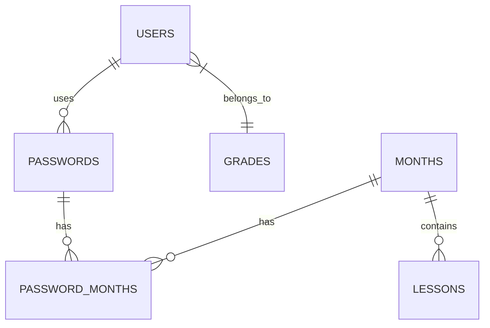

# منصة الأستاذ عصام سماكة التعليمية

منصة تعليمية شاملة لإدارة الدروس والشهور والصفوف والوصول للمستخدمين.

## نظرة عامة على النظام

تم تصميم هذه المنصة لإدارة المحتوى التعليمي مع الميزات الرئيسية التالية:
- تنظيم الدروس الشهرية
- إدارة محتوى الفيديو
- تكامل نظام الامتحانات
- التحكم في وصول المستخدمين من خلال كلمات المرور
- إدارة المستخدمين حسب الصفوف

## وصف الموقع

منصة الأستاذ عصام سماكة هي نظام تعليمي متكامل يهدف إلى تسهيل عملية التعليم عن بعد وإدارة المحتوى التعليمي. المنصة مصممة خصيصاً لتلبية احتياجات الطلاب والمعلمين في بيئة تعليمية منظمة وفعالة.

### المميزات الرئيسية:

1. **إدارة المحتوى التعليمي**:
   - تنظيم الدروس حسب الشهور الدراسية
   - رفع وإدارة مقاطع الفيديو التعليمية
   - تحديد الدروس المميزة والمحتوى المدفوع
   - تتبع مشاهدات وتحميلات المحتوى

2. **نظام الامتحانات**:
   - إمكانية إضافة امتحانات لكل درس
   - تحديد مدة الامتحان ودرجة النجاح
   - إدارة عدد المحاولات المسموح بها
   - تتبع نتائج الطلاب

3. **إدارة المستخدمين**:
   - تسجيل وإدارة الطلاب
   - تنظيم الطلاب حسب الصفوف الدراسية
   - تتبع نشاط المستخدمين
   - إدارة صلاحيات الوصول

4. **نظام الوصول**:
   - التحكم في الوصول من خلال كلمات مرور
   - ربط كلمات المرور بشهور محددة
   - تتبع استخدام كلمات المرور
   - إدارة صلاحية كلمات المرور

5. **التحليلات والإحصائيات**:
   - تتبع عدد المشاهدات
   - تتبع التحميلات
   - نظام تقييم المحتوى
   - قياس تفاعل المستخدمين

## هيكل قاعدة البيانات

### الكيانات الأساسية

1. **المستخدمين**
   - معلومات الطلاب
   - ربط بالصفوف
   - تتبع الوصول
   - المصادقة

2. **الصفوف**
   - المستويات التعليمية
   - تجميع الطلاب
   - إدارة الترتيب

3. **الشهور**
   - الفترات الدراسية
   - تنظيم الدروس
   - التحكم في الوصول بكلمات المرور

4. **الدروس**
   - محتوى الفيديو
   - تكامل الامتحانات
   - علامات المحتوى المدفوع
   - تتبع المشاهدات
   - نظام التقييم

5. **كلمات المرور**
   - التحكم في الوصول
   - ربط بالشهور
   - تتبع الاستخدام
   - إدارة الصلاحية

### العلاقات



## المميزات

### إدارة المستخدمين
- تسجيل ومصادقة المستخدمين
- تنظيم المستخدمين حسب الصفوف
- التحكم في الوصول من خلال كلمات المرور
- تتبع نشاط المستخدمين

### إدارة المحتوى
- تنظيم الدروس الشهرية
- استضافة محتوى الفيديو
- علامات المحتوى المدفوع
- تمييز المحتوى المميز
- ترتيب وفرز المحتوى

### نظام الامتحانات
- وظائف امتحان متكاملة
- مدة امتحان قابلة للتكوين
- متطلبات درجة النجاح
- إدارة المحاولات المتعددة
- إدارة الأسئلة

### التحكم في الوصول
- الوصول القائم على كلمات المرور
- الوصول المحدد للشهر
- انتهاء صلاحية كلمة المرور
- تتبع الاستخدام
- حالة النشاط/عدم النشاط

### التحليلات
- عد المشاهدات
- تتبع التحميلات
- نظام التقييم
- مقاييس تفاعل المستخدمين


## التثبيت

1. استنساخ المستودع:
```bash
git clone https://github.com/Ahmedelhussuini900/MrEssamSamaka.git
```

2. تثبيت التبعيات:
```bash
composer install
```
`

## الاستخدام

### إدارة المستخدمين
- إنشاء مستخدمين مع ربطهم بالصفوف
- إدارة وصول المستخدمين من خلال كلمات المرور
- تتبع نشاط وتفاعل المستخدمين

### إدارة المحتوى
1. إنشاء شهور لتنظيم المحتوى
2. إضافة دروس إلى شهور محددة
3. تكوين محتوى الفيديو والخيارات
4. إعداد الامتحانات إذا لزم الأمر
5. إدارة الوصول من خلال كلمات المرور

### التحكم في الوصول
1. إنشاء كلمات مرور لشهور محددة
2. تعيين كلمات المرور للمستخدمين
3. تتبع استخدام وانتهاء صلاحية كلمات المرور
4. إدارة حالة النشاط/عدم النشاط

## المساهمة

1. تفرع المستودع
2. إنشاء فرع الميزة الخاصة بك
3. التزام تغييراتك
4. دفع إلى الفرع
5. إنشاء طلب سحب


## الاتصال

- **المطور**: أحمد الحسيني
- **البريد الإلكتروني**: [Ahmedelhussini1200@gmail.com or whatsapp 01099042793]
